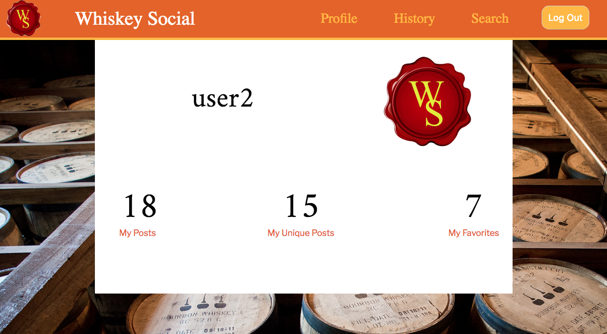
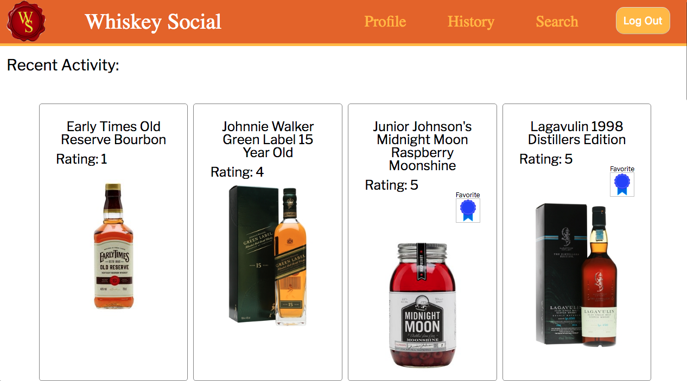
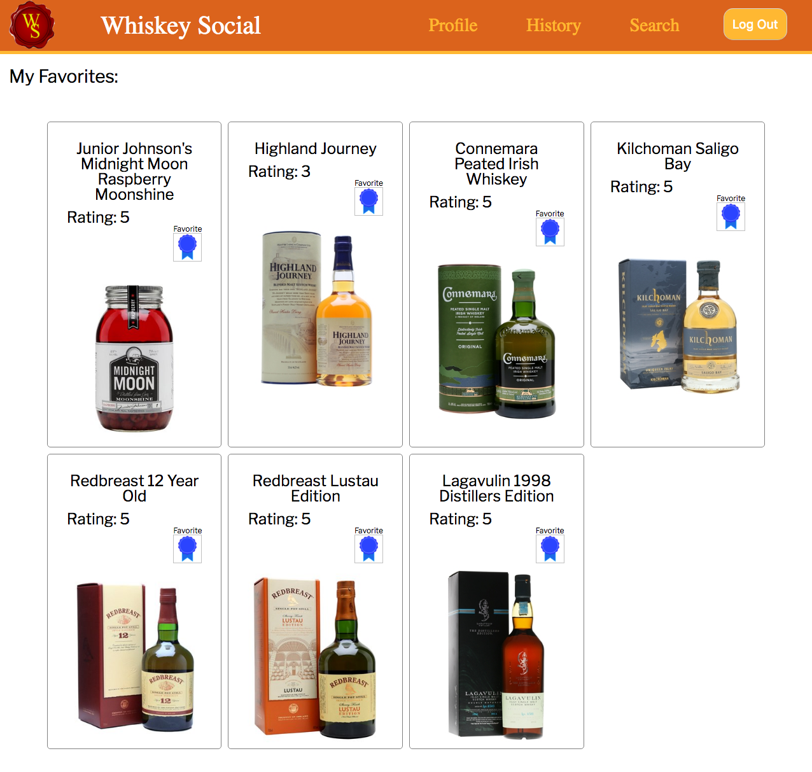
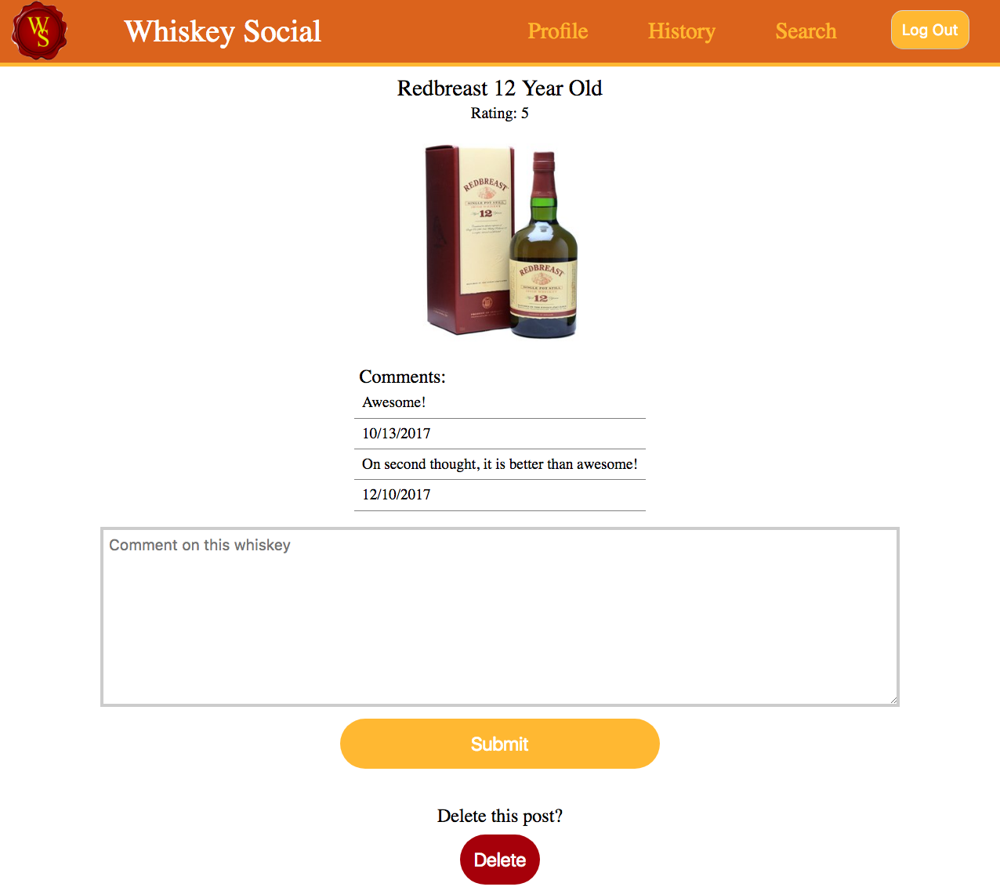
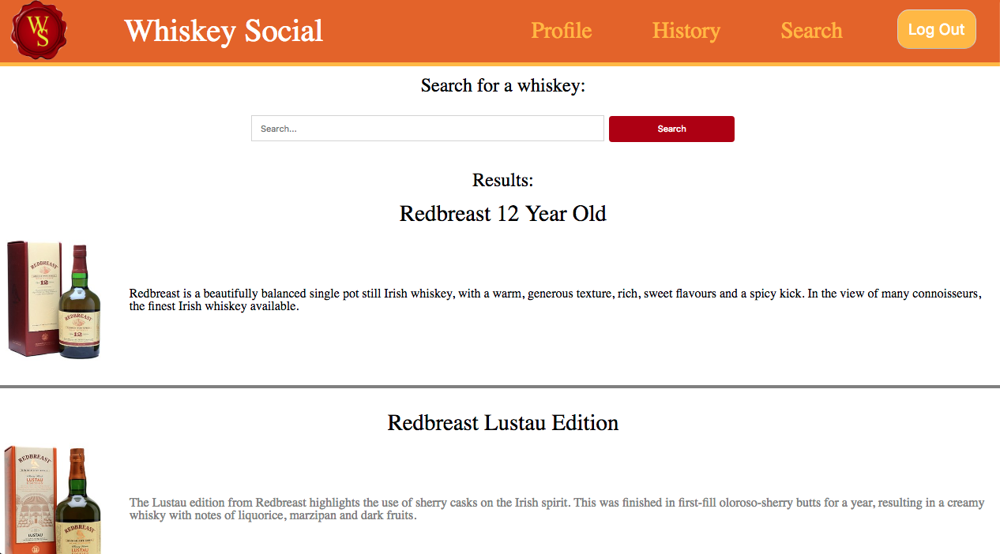
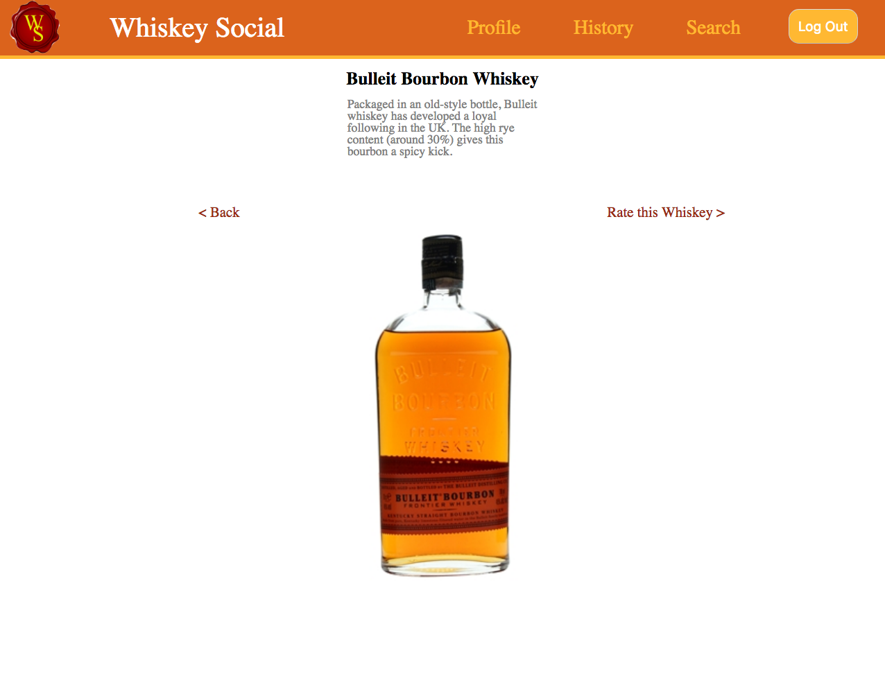
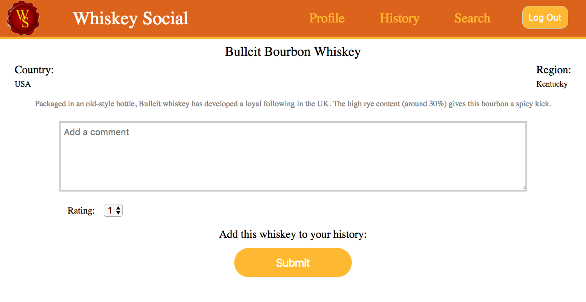

# Whiskey Social
http://whiskey-social.herokuapp.com/

# Summary
Whiskey Social allows you to keep track of all the different whiskeys you've tried.  You can also rate them, keep track of your favorites, and make notes on each whiskey in your collection.

# Features

### Profile Page:
Your Profile Page shows a number for:
  - **My Posts** - The total number of whiskeys that you have tasted.
  - **My Unique Posts** - The number of different whiskeys that you have tasted.
  - **My Favorites** - The number of whiskeys you have designated as a favorite.

Just click on the number and you'll be redirected to a list of whiskeys in the corresponding category.  The list will show the name, photo, and rating of your whiskey, along with a blue-ribbon favorite designation for those you have favorited.

### Whiskey Search:
- Search the database of over 1,700 whiskeys, bourbons, and scotches from around the world.
- A short description and an image of the bottle are shown for each result.

### Add notes to each of your posted whiskeys:
- Click on any whiskey on any of the 3 'posts' pages and you'll be able to see any comments you've made associated with that whiskey, along with the ability to add other comments.

# Screenshots
            

            

            

# Tech Stack

- HTML5
- CSS3
- JavaScript / ES6
- Pug
- Node.js
- Express
- MongoDB
- Passport
- Cheerio web scraper
- Mocha & Chai
- Adobe XD
- TravisCI
- Heroku

# Coming Soon

1. Ability to add friends & see each other's posts.
2. Add comments to and reply to comments on friend's posts.
3. Add a new whiskey to the database for all users to access.
4. Earn badges for drinking certain numbers or types of whiskeys.
5. Signup / Login with an existing Twitter, Facebook, or UnTappd account.
6. Add a profile photo.
7. Free bottle of Johnnie Walker Blue delivered to you just for creating an account!

